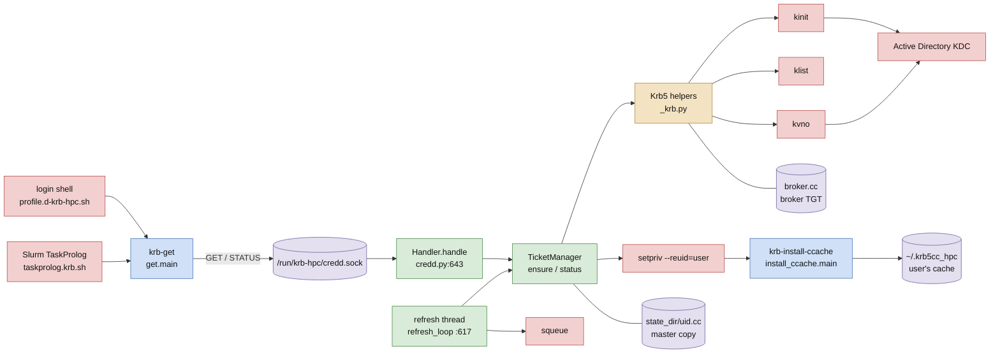
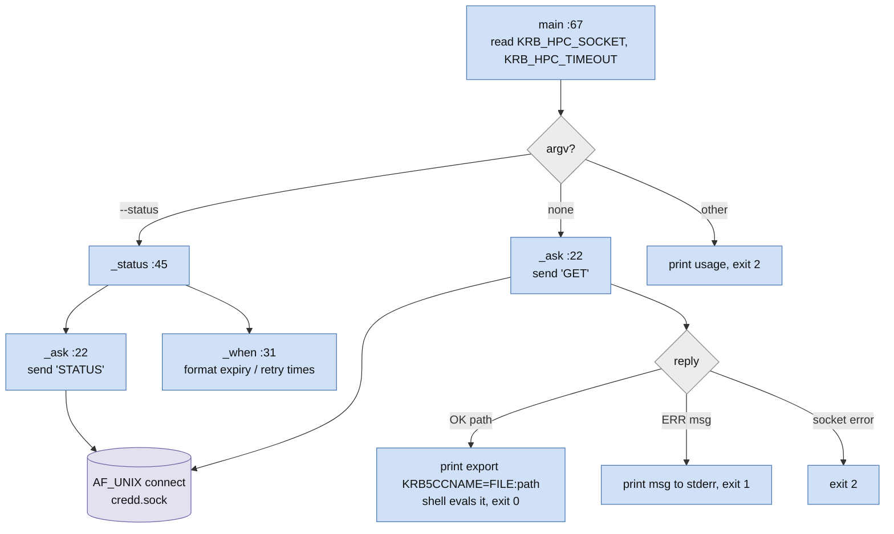
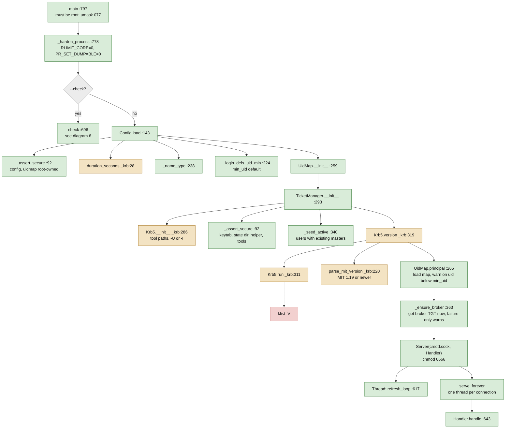
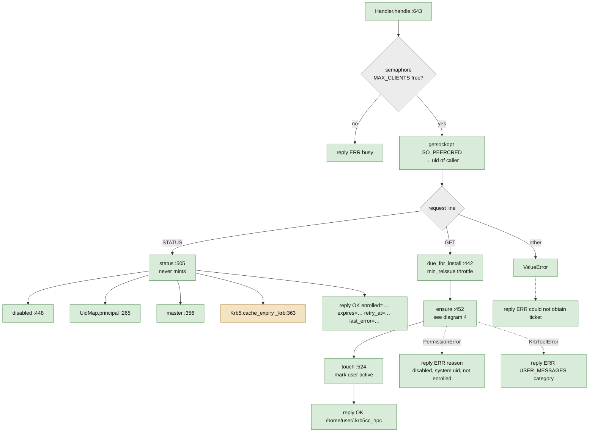
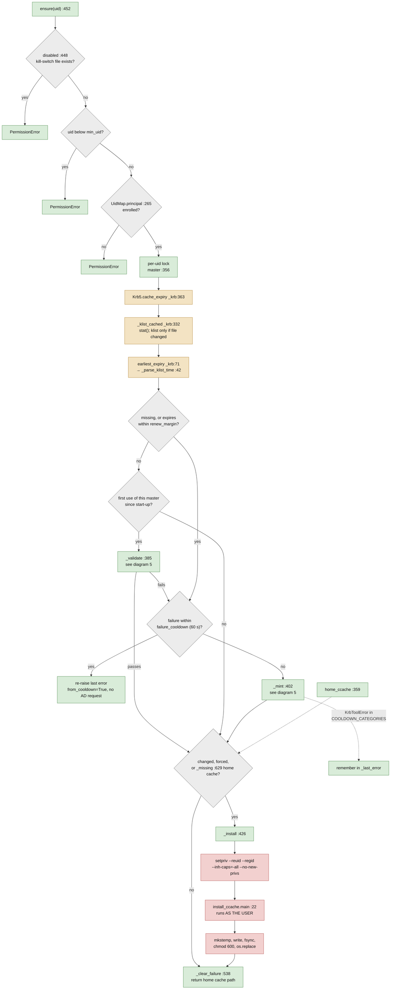
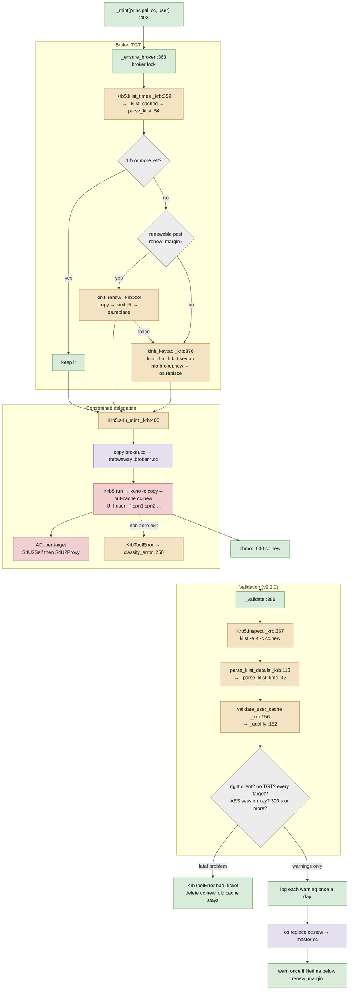
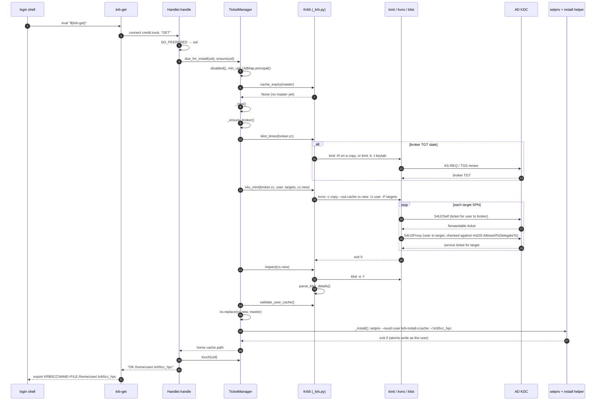
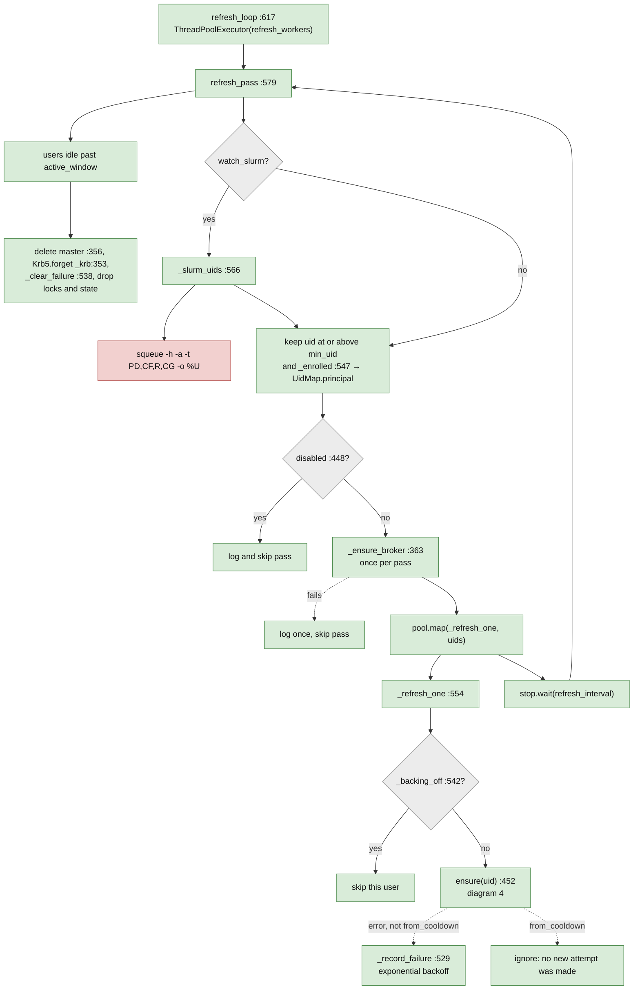
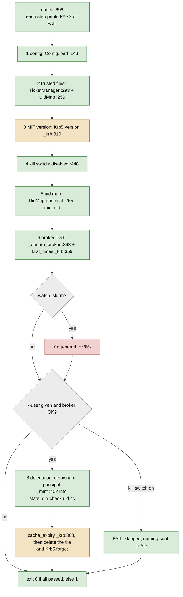

# krb-credd call graph

Every function call in the krb-credd data flow (version 2.3.0). Each diagram follows one path through the code; labels give `file:line` of the function definition (credd.py unless another file is named). An interactive version with the same diagrams is in [`krb-credd-call-graph.html`](krb-credd-call-graph.html).

**Colour key:** blue = krb-get (user side) · green = credd.py (daemon) · amber = _krb.py (Kerberos helpers) · red = external program · purple = file / socket · grey = decision.

Contents: [Overview: who calls whom](#overview) · [krb-get, the client](#client) · [Daemon start-up](#startup) · [Handling a socket request](#request) · [ensure(): decide whether to mint and install](#ensure) · [Minting: broker TGT, S4U, validation](#mint) · [One GET, end to end (first login, nothing cached)](#sequence) · [Background refresh thread](#refresh) · [krb-credd --check [--user NAME]](#check)

## 0. Overview: who calls whom

- Two entry points drive all minting: a user's `krb-get` request, and the daemon's own refresh thread.
- Only `kinit` and `kvno` talk to AD. `klist` only reads local cache files.
- The daemon is root; the only code that writes into a home directory runs as the user under `setpriv`.

## 1. krb-get, the client

*src/krbhpc/get.py*

- `krb-get` sends nothing about who the user is. The daemon reads the caller's UID from the socket with `SO_PEERCRED`.
- The path is quoted with `shlex.quote` because the shell evaluates the output.

## 2. Daemon start-up

*credd.py main :797*

- A bad config, insecure file permissions or a non-MIT `klist` stop the daemon with one clear line.
- The broker TGT is fetched at start-up so a bad keytab shows in the log at once. See diagram 5 for what `_ensure_broker` does.

## 3. Handling a socket request

*credd.py Handler.handle :643*

## 4. ensure(): decide whether to mint and install

*credd.py :452*

- The cooldown applies only to errors an administrator must fix: `not_delegable`, `unknown_principal`, `bad_ticket`. Timeouts and KDC outages retry at once.
- The master copy in `state_dir` is the source of truth. The home copy is reinstalled when it changes, when `due_for_install` says so, or when the user deleted it.

## 5. Minting: broker TGT, S4U, validation

*credd.py _mint :402 · _krb.py*

- The S4U2Self and S4U2Proxy requests happen inside one `kvno` process, one target after another. The throwaway copy exists because `kvno` also stores the S4U2Proxy tickets in its input cache.
- `ticket_checks = warn` turns only the user-name checks into warnings. The TGT, target, AES and lifetime checks stay fatal.

## 6. One GET, end to end (first login, nothing cached)

## 7. Background refresh thread

*credd.py :554–627*

- A user is refreshed while they have used `krb-get` recently, or (with `watch_slurm`) while they have a pending or running job.
- Each user's mint and install is serialized by the per-uid lock taken in `ensure`, so a request and a refresh never mint the same user twice at once.

## 8. krb-credd --check [--user NAME]

*credd.py check :696*

- `--check --user` runs the full mint and validation from diagram 5 but never installs anything into a home directory.

## Function index

| Function | File | Line | Calls |
|---|---|---|---|
| `main` | get.py | 67 | _status, _ask |
| `_status` | get.py | 45 | _ask, _when |
| `_ask` | get.py | 22 | socket connect / send / readline |
| `_when` | get.py | 31 | time formatting |
| `main` | credd.py | 797 | _harden_process, check, Config.load, UidMap, TicketManager, Krb5.version, UidMap.principal, _ensure_broker, Server, refresh_loop thread |
| `_harden_process` | credd.py | 778 | setrlimit, prctl |
| `_assert_secure` | credd.py | 92 | os.stat |
| `Config.load` | credd.py | 143 | _assert_secure, duration_seconds, _name_type, _login_defs_uid_min |
| `_login_defs_uid_min` | credd.py | 224 | reads /etc/login.defs |
| `_name_type` | credd.py | 238 |  |
| `UidMap.__init__ / principal` | credd.py | 259 / 265 | reads uidmap.conf |
| `TicketManager.__init__` | credd.py | 293 | Krb5, _assert_secure, _seed_active |
| `_seed_active` | credd.py | 340 | lists state_dir |
| `master / home_ccache` | credd.py | 356 / 359 | path helpers |
| `_ensure_broker` | credd.py | 363 | klist_times, kinit_renew, kinit_keytab, os.replace |
| `_validate` | credd.py | 385 | Krb5.inspect, validate_user_cache |
| `_mint` | credd.py | 402 | _ensure_broker, s4u_mint, _validate, os.replace |
| `_install` | credd.py | 426 | home_ccache, setpriv → install_ccache.main |
| `due_for_install` | credd.py | 442 |  |
| `disabled` | credd.py | 448 | disable_file.exists() |
| `ensure` | credd.py | 452 | disabled, UidMap.principal, master, cache_expiry, _validate, _mint, home_ccache, _missing, _install, _clear_failure |
| `status` | credd.py | 505 | disabled, UidMap.principal, master, cache_expiry |
| `touch` | credd.py | 524 |  |
| `_record_failure / _clear_failure / _backing_off` | credd.py | 529 / 538 / 542 | backoff bookkeeping |
| `_enrolled` | credd.py | 547 | UidMap.principal |
| `_refresh_one` | credd.py | 554 | _backing_off, ensure, _record_failure |
| `_slurm_uids` | credd.py | 566 | squeue |
| `refresh_pass` | credd.py | 579 | master, Krb5.forget, _clear_failure, _slurm_uids, _enrolled, disabled, _ensure_broker, _refresh_one |
| `refresh_loop` | credd.py | 617 | refresh_pass |
| `_missing` | credd.py | 629 | os.stat |
| `Handler.handle` | credd.py | 643 | status, due_for_install, ensure, touch |
| `check` | credd.py | 696 | Config.load, TicketManager, UidMap, version, disabled, principal, _ensure_broker, klist_times, squeue, _mint, cache_expiry, forget |
| `duration_seconds` | _krb.py | 28 |  |
| `_parse_klist_time` | _krb.py | 42 |  |
| `parse_klist` | _krb.py | 54 | _parse_klist_time |
| `earliest_expiry` | _krb.py | 71 | _parse_klist_time |
| `parse_klist_details` | _krb.py | 113 | _parse_klist_time |
| `_qualify` | _krb.py | 152 |  |
| `validate_user_cache` | _krb.py | 156 | _qualify |
| `parse_mit_version` | _krb.py | 220 |  |
| `classify_error / KrbToolError` | _krb.py | 250 / 262 | maps kvno/kinit stderr to a category |
| `Krb5.run` | _krb.py | 311 | subprocess.run (kinit, klist, kvno) |
| `Krb5.version` | _krb.py | 319 | run (klist -V), parse_mit_version |
| `Krb5._klist_cached` | _krb.py | 332 | os.stat, run (klist) |
| `Krb5.forget` | _krb.py | 353 |  |
| `Krb5.klist_times` | _krb.py | 359 | _klist_cached + parse_klist |
| `Krb5.cache_expiry` | _krb.py | 363 | _klist_cached + earliest_expiry |
| `Krb5.inspect` | _krb.py | 367 | run (klist -e -f), parse_klist_details |
| `Krb5.kinit_keytab` | _krb.py | 376 | run (kinit -k -t) |
| `Krb5.kinit_renew` | _krb.py | 384 | copyfile, run (kinit -R), os.replace |
| `Krb5.s4u_mint` | _krb.py | 406 | copy broker cache, run (kvno -U\|-I -P) |
| `main` | install_ccache.py | 22 | mkstemp, write, fsync, chmod, os.replace |

Line numbers point at each function's `def` in `src/krbhpc/`.
